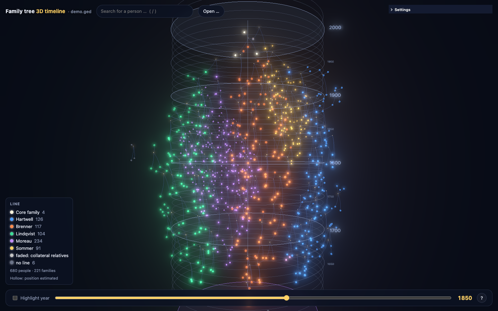
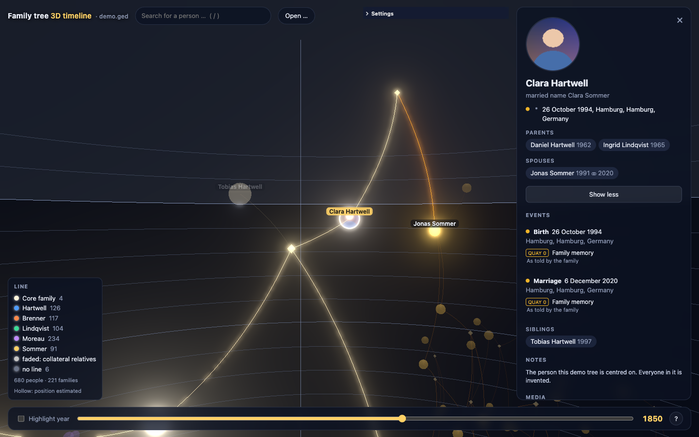

# gedcom-3d

A GEDCOM family tree as a 3D graph laid out along time. One axis is the
calendar: every person sits at the year of their birth, every couple's union
knot at their wedding. The other two dimensions are left to a force layout,
which pulls each bloodline into its own sector around the time axis. Drag to
turn it, scroll to zoom, Shift+scroll to travel through the centuries.

**[Try the demo](https://micro23xd.github.io/gedcom-3d/)**. It shows an invented
family; open your own file with *Open …* or drop it on the window. It is read in
your browser and never uploaded.



## What it shows

- **Time as layers.** Rings mark every decade, brighter ones every century. A
  year slider dims everyone not alive in that year.
- **Bloodlines.** The root's four grandparents and the partners of the root
  and their siblings each anchor a line. Everyone descending into the root
  through that anchor takes its colour. An ancestor reached through two lines
  — a pedigree collapse — is drawn once, in the blend of both. Collateral
  relatives inherit the colour of their nearest line, faded.
- **A click** lights up a person's ancestors and descendants and opens a
  panel: portrait, life dates, parents, partners, children. *Show more* adds
  every event with its citations and their `QUAY`, the notes, the media and
  the research state.
- **Names around the pointer**, not only under it, within an adjustable radius.
- **Evidence.** Colour by the weakest evidence per person: a record (QUAY 3), a
  secondary witness (QUAY 2), only a hint (QUAY 0–1), or nothing cited. Or
  colour by research state: who still has unknown parents (the frontier), and
  who is not connected to the root at all.
- **More node types on demand**: events per type (birth, marriage, occupation,
  …), places and sources as hubs. People can be drawn as life lines from birth
  to death, with time running up the screen or into it as a tunnel.
- **Everything visual is a setting**, applied live. The working state survives a
  reload, presets can be saved, and *Copy as JSON* hands one over for
  `src/presets.json`.
- **German and English.** It follows the browser; `?lang=de` or `?lang=en`
  forces one.



## Privacy

Family trees name living people. The viewer is built so that a tree never
leaves the machine it is looked at on:

- **Local files.** A file opened or dropped is read by the browser (File API).
  Nothing is uploaded, and it is held in memory only.
- **Same origin only.** `?ged=<path>` is fetched only from the server that
  serves the page. A URL on another host is refused, and so no proxy ever sees
  the file.
- **No outside media.** Media are shown only from that same server. A tree's
  links to images on a genealogy portal, or to `C:\…` on somebody's disk, are
  never requested.
- **Nothing remote in the bundle.** There are no CDNs, webfonts or analytics.
  The build fails if the page, a stylesheet or the bundle names such a host
  (`npm run check:offline`, also run in CI).
- **Positions stay in the browser.** Positions, camera and settings live in
  `sessionStorage` and `localStorage`.

## Use it

```sh
npm ci
npm run dev            # http://127.0.0.1:5173 — open a file from there
npm test
npm run build          # → dist/, static files, serve them from anywhere
```

To show a tree on start, serve `dist/` next to it and point `?ged=` at it:

```
index.html?ged=/data/tree.ged&root=I42&lang=en
```

| Parameter | Meaning |
|---|---|
| `ged` | A GEDCOM on the same server. Without it the page offers to open a file. |
| `root` | The xref of the person to centre on. Without it: whoever has the deepest pedigree; among siblings, the one with a family of their own in the file, then the youngest. |
| `lang` | `de` or `en`. |

The dev server can serve your tree's files too. Name the directories it may
read, relative to a root:

```sh
GEDCOM3D_ROOT=~/my-tree GEDCOM3D_SERVE=data,media npm run dev
# → http://127.0.0.1:5173/?ged=/data/tree.ged
```

Keyboard: `/` search, `O` open a file, `F` overview, `↑` `↓` through time,
`Esc` clear the selection.

## GEDCOM support

The viewer reads GEDCOM 5.5.1 leniently:

- **Encodings**: UTF-8, UTF-16 (by its byte-order mark), ANSI/Windows-1252,
  and ANSEL as Windows-1252 with a warning. Browsers have no ANSEL decoder.
- **Line ends**: CRLF, LF, and the bare CR of old Mac exports.
- **Dates**: exact days, month-years and years; `ABT`, `EST`, `CAL`, `BEF`,
  `AFT`, `BET … AND …`, `FROM … TO …`; dual years (`1700/01`); and numeric
  dates (`14.03.1989`) as some German programs write them.
- **Records**: `INDI`, `FAM`, `SOUR` and `OBJE`. The events it reads are birth,
  baptism, religion, occupation, residence, emigration, generic events,
  marriage, divorce, death and burial.

A person without a birth or baptism date sits at an *estimated* year, worked out
from their own dated events or from dated relatives. That estimate is for the
layout only: the node is drawn hollow and the panel says so. People nothing
dates at all sit on a band "undated" below the oldest year.

## Evidence counts and an external classifier

The evidence rules are deliberately simple:
- **Fact**: a birth, baptism, death, burial or marriage that states a date or
  a place.
- **Quality**: the best `QUAY` among the fact's citations.
- **Person's state**: their weakest fact.

That makes the counts reproducible elsewhere. If another tool classifies the
same file, `test/crosscheck.spec.ts` holds the viewer to it:

```sh
GEDCOM_PATH=tree.ged EXPECTED_JSON=counts.json ROOT=I1 PENDING_SOURCE=S_X npx vitest run test/crosscheck.spec.ts
```

The spec's header describes the JSON it expects.

## Development

The code is TypeScript, built by Vite. The libraries are
[3d-force-graph](https://github.com/vasturiano/3d-force-graph) on three.js,
three-spritetext and lil-gui. There is no framework.

| Path | What |
|---|---|
| `src/gedcom/` | line parser, date parser, character decoding |
| `src/model.ts` | persons, families, events, citations, media |
| `src/evidence.ts` | evidence tiers, frontier, detached |
| `src/timeline.ts` | time positions and estimates, generations |
| `src/lines.ts` | bloodlines and the default root |
| `src/graph.ts` | which records become nodes and links |
| `src/scene/` | the 3D scene, time grid, portraits |
| `src/ui/` | panel, legend, search, settings, open/drop |
| `src/i18n.ts` | German and English |
| `scripts/make-demo.mjs` | the invented demo tree and the test fixtures (`npm run demo`) |

The tests run on the demo tree and small fixtures in `test/fixtures/`, never
on a real family. Please keep it that way in pull requests: `.gitignore`
excludes `private/` and `*.private.ged` for trees you test with locally.

## Licence

MIT, see [LICENSE](LICENSE).
